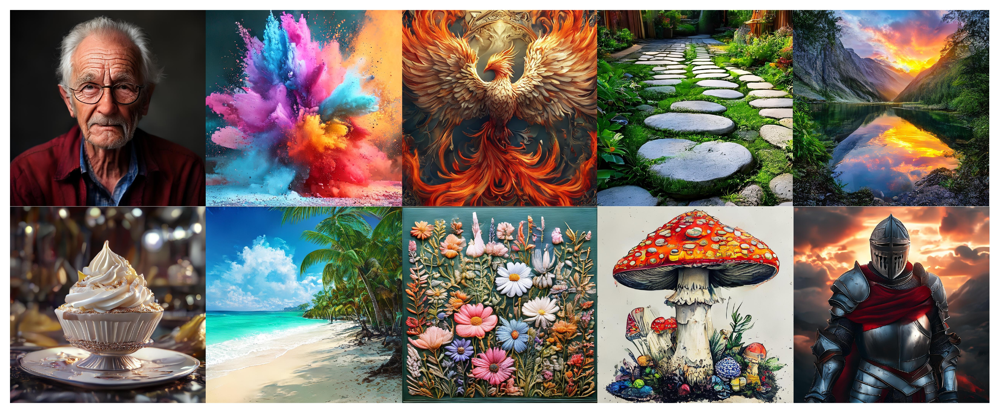
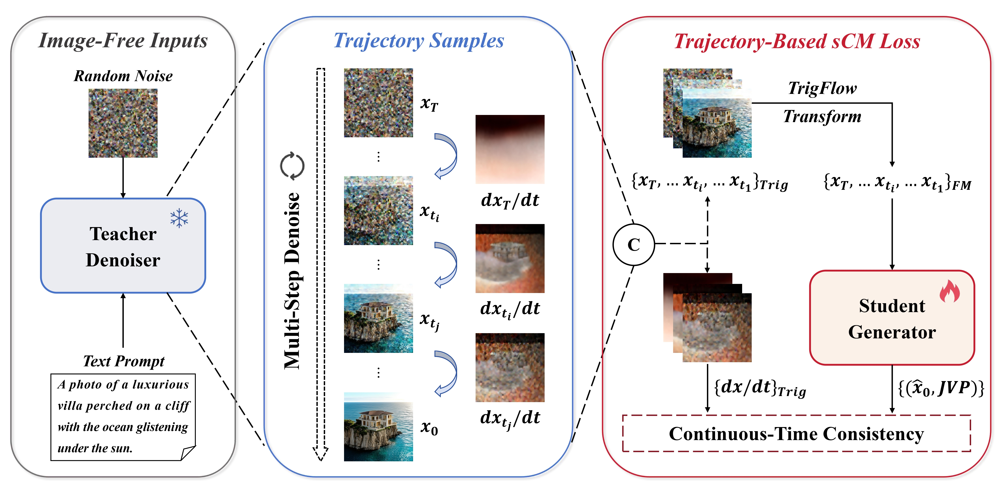
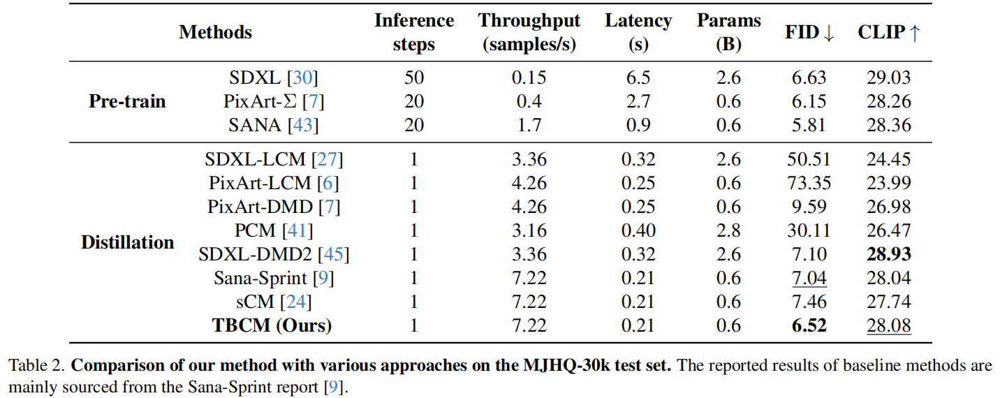
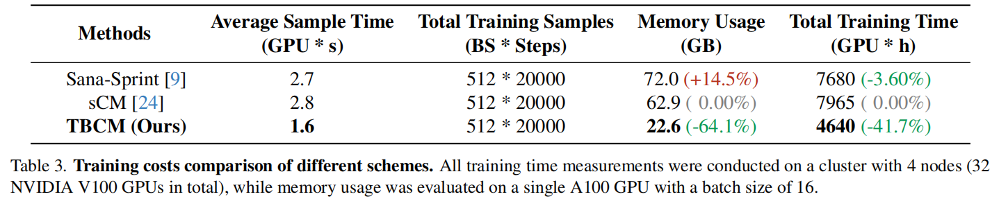

<div align="center">
<h1>Image-Free Timestep Distillation via Continuous-Time Consistency with Trajectory-Sampled Pairs</h1>

**_Efficient Timestep Distillation Without Real Images_**

[Bao Tang](https://github.com/Tt-DAY), [Shuai Zhang](https://github.com/Shuaizhang7), [Yueting Zhu](https://github.com/lazypomeloo), Jijun Xiang, Xin Yang, Li Yu, [Wenyu Liu](http://eic.hust.edu.cn/professor/liuwenyu), [Xinggang Wang](https://xwcv.github.io/index.htm)<sup>📧</sup>

Huazhong University of Science and Technology (HUST)

(📧 corresponding author: xgwang@hust.edu.cn)

</div>

<div align="center">

</div>

## ✨ Highlights

🖼️ **Image-Free Distillation Framework** — Performs consistency distillation using intermediate states from pretrained model inference, eliminating the need for real training images.

🎯 **Pure Latent Space Training** — The entire distillation pipeline operates in latent space without requiring VAE encoding/decoding during training.

⚡ **Dramatic Efficiency Gains** — Reduces GPU memory usage by ~64.1% and training time by ~41.7% compared to standard sCM under identical configurations.

📊 **Superior Generation Quality** — Achieves FID 6.52 on MJHQ30k by eliminating training-inference inconsistencies, outperforming baseline methods.


## 📰 News
- **[2025.12.16]** Training code has been released.
- **[2025.11.25]** We’ve released our paper on [arXiv](https://arxiv.org/abs/2511.20410).

## 📝 Introduction

Timestep distillation is an effective approach for improving the generation efficiency of diffusion models. The Consistency Model (CM), as a trajectory-based framework, demonstrates significant potential due to its strong theoretical foundation and high-quality few-step generation.
Nevertheless, current continuous-time consistency distillation methods still rely heavily on training data and computational resources, hindering their deployment in resource-constrained scenarios and limiting their scalability to diverse domains.
To address this issue, we propose **Trajectory-Backward Consistency Model (TBCM)**, which eliminates the dependence on external training data by extracting latent representations directly from the teacher model's generation trajectory. Unlike conventional methods that require VAE encoding and large-scale datasets, our self-contained distillation paradigm significantly improves both efficiency and simplicity.
Moreover, the trajectory-extracted samples naturally bridge the distribution gap between training and inference, thereby enabling more effective knowledge transfer.
Empirically, TBCM achieves **6.52 FID** and **28.08 CLIP** scores on MJHQ-30k under one-step generation, while reducing training time by approximately **40%** compared to Sana-Sprint and saving a substantial amount of GPU memory, demonstrating superior efficiency without sacrificing quality.
We further reveal the diffusion-generation space discrepancy in continuous-time consistency distillation and analyze how sampling strategies affect distillation performance, offering insights for future distillation research.

<div align="center">
  
</div>

## 📊 Results
<div align="center">

</div>
<div align="center">

</div>

## 🛠️ How to Use
### Environment
We recommend using `conda` to set up the environment.

```bash
conda create -n your_env_name python=3.10 -y
conda activate your_env_name
pip install -U xformers==0.0.27.post2 --index-url https://download.pytorch.org/whl/cu121
pip install -e .
```

### Preparation
Before training, you need to prepare the dataset and required pretrained weights. 
1. **Dataset**: You only need to prepare a text file as the dataset, with one prompt per line.
2. **Pretrained Weights**: You need to download the pretrained [Text Encoder](https://huggingface.co/Efficient-Large-Model/gemma-2-2b-it), [VAE](https://huggingface.co/mit-han-lab/dc-ae-f32c32-sana-1.1-diffusers), and [Diffusion Model](https://huggingface.co/Efficient-Large-Model/Sana_Sprint_0.6B_1024px_teacher)

### Train
Run the training script with the desired configuration.

```bash
bash train_scripts/train_tbcm.sh configs/600M_1024px_tbcm.yaml
```

## ⭐ Acknowledgements
This work is built upon the **[Sana series](https://github.com/NVlabs/Sana)** (Sana, Sana 1.5, Sana-Sprint). We sincerely thank the authors for their wonderful works and contributions to the community.

## 📄 Citation
If you find TBCM useful, please consider giving us a star 🌟 and citing it as follows:

```bibtex
@misc{tang2025tbcm,
      title={Image-Free Timestep Distillation via Continuous-Time Consistency with Trajectory-Sampled Pairs}, 
      author={Bao Tang and Shuai Zhang and Yueting Zhu and Jijun Xiang and Xin Yang and Li Yu and Wenyu Liu and Xinggang Wang},
      year={2025},
      eprint={2511.20410},
      archivePrefix={arXiv},
      primaryClass={cs.CV},
      url={https://arxiv.org/abs/2511.20410}, 
}